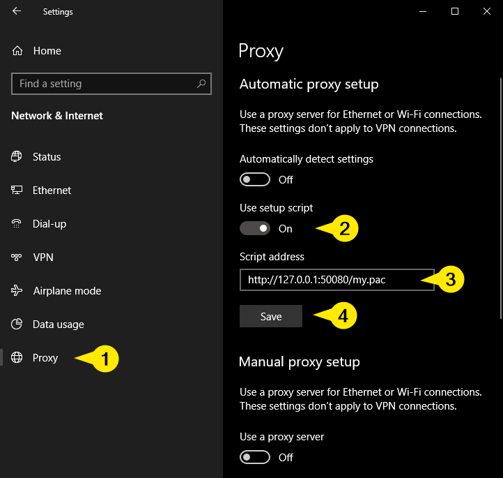
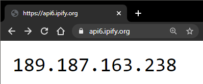

# Proxied OpenVPN

For those that want a "local" proxy that routes traffic through OpenVPN, without having the WHOLE host machine be on OpenVPN. :P This will be a near-perfect solution for you...

**TIP**: Use Proxy Auto-Configuration (PAC) files <[guide](https://developer.mozilla.org/en-US/docs/Web/HTTP/Proxy_servers_and_tunneling/Proxy_Auto-Configuration_(PAC)_file)>

**WARNING**: Not meant for production!!!

## How to?

PM2 (runner) inside the container will expect an EXECUTABLE (`chmod +x`) `/root/ovpn/connect.sh` script to be available inside the container (ie: mounted).

Example, if "`--volume $(pwd)/ovpn:/root/ovpn`":

* `./ovpn` directory contents:
  ```bash
  -rwxrwxr-x 1 someone someone  366 Aug 15 04:49 connect.sh
  -rw-r--r-- 1 someone someone 2954 Aug 15 04:47 myvpn.ovpn
  -rw-r--r-- 1 someone someone   50 Aug 14 21:18 myvpn.pass
  ```
  If `myvpn.ovpn` must is password-based: `auth-user-pass` must specify an absolute path.
  
  In this example, it'll be: `auth-user-pass /root/ovpn/myvpn.pass`
* `./ovpn/connect.sh` contents:
  ```bash
  #!/bin/bash
  # add some custom logic which dynamically modifies .ovpn
  # or other pre-connect routines you want to add...
  openvpn --config /root/ovpn/myvpn.ovpn 2>&1
  ```
  ... or just very simply:
  ```bash
  #!/bin/bash
  openvpn --config /root/ovpn/myvpn.ovpn 2>&1
  ```
* Run:
  ```bash
  docker run --name proxied-openvpn \
    --detach --restart always \
    --cap-add=NET_ADMIN \
    --dns '8.8.8.8' \
    --publish 53128:3128 \
    --volume "$(pwd)/ovpn:/root/ovpn" \
    proxied-openvpn:latest
  ```
* Test:
  ```bash
  # Check docker host's public IP:
  echo Host Public IP: \
    $(curl --silent https://api6.ipify.org)
  # Check proxied-openvpn's public IP:
  echo proxied-openvpn Public IP: \
    $(curl --silent --proxy http://127.0.0.1:53128 \
      https://api6.ipify.org)
  ```
  Sample output:
  ```bash
  $ echo Host Public IP: \
  >   $(curl --silent https://api6.ipify.org)
  Host Public IP: 252.32.109.191
  
  $ echo proxied-openvpn Public IP: \
  >   $(curl --silent --proxy http://127.0.0.1:53128 \
  >     https://api6.ipify.org)
  proxied-openvpn Public IP: 189.187.163.238
  ```

Voila! You may now use it as `http_proxy`!

## Static files web-hosting (w/ sample PAC)

As hinted above, you may want to opt for a Proxy Auto-Configuration (PAC).

Ref: [MDN web docs - Proxy Auto-Configuration (PAC) file](https://developer.mozilla.org/en-US/docs/Web/HTTP/Proxy_servers_and_tunneling/Proxy_Auto-Configuration_(PAC)_file)

On top of hosting `.pac` files, you may host some other static files as well (as you need).
Just mount the host directory where your static files are, to the container's `/var/www/html`. 

Here's an example:

* `./static` directory contents:
  ```bash
  -rw-rw-r-- 1 core core 403 Aug 15 06:02 my.pac
  ```
* `./static/my.pac` contents (based on published port `53128` from buide above):
  ```javascript
  function FindProxyForURL(url, host) {
    // DO NOT PROXY "LOCAL" IPs/HOSTNAMES:
    if (isInNet(host, "127.0.0.0", "255.0.0.0") ||
        isInNet(host, "10.0.0.0", "255.0.0.0") ||
        isInNet(host, "172.16.0.0", "255.240.0.0") ||
        isInNet(host, "192.168.0.0", "255.255.0.0") ||
        isPlainHostName(host)) {
      return "DIRECT";
    }
    // THEN PROXY EVERYTHING ELSE
    return "PROXY 127.0.0.1:53128"
  }
  ```
* Run:
  ```bash
  docker run --name proxied-openvpn \
    --detach --restart always \
    --cap-add=NET_ADMIN \
    --dns '8.8.8.8' \
    --publish 50080:80 \
    --publish 53128:3128 \
    --volume "$(pwd)/ovpn:/root/ovpn" \
    --volume "$(pwd)/static:/var/www/html" \
    proxied-openvpn:latest
  ```
  Note diff from example above in _"How to?"_: the `50080:80` port and `--volume "$(pwd)/static:/var/www/html"`.
* Test #1:
  ```bash
  curl --verbose http://127.0.0.1:50080/my.pac
  ```
  Sample output:
  ```bash
  $ curl --verbose http://127.0.0.1:50080/my.pac
  *   Trying 127.0.0.1:50080...
  * TCP_NODELAY set
  * Connected to 127.0.0.1 (127.0.0.1) port 50080 (#0)
  > GET /my.pac HTTP/1.1
  > Host: 127.0.0.1:50080
  > User-Agent: curl/7.68.0
  > Accept: */*
  > 
  * Mark bundle as not supporting multiuse
  < HTTP/1.1 200 OK
  < Date: Fri, 14 Aug 2020 22:07:28 GMT
  < Server: Apache/2.4.41 (Ubuntu)
  < Last-Modified: Fri, 14 Aug 2020 22:02:01 GMT
  < ETag: "193-5acdd9212a2c7"
  < Accept-Ranges: bytes
  < Content-Length: 403
  < Content-Type: application/x-ns-proxy-autoconfig
  < 
  function FindProxyForURL(url, host) {
    // DO NOT PROXY "LOCAL" IPs/HOSTNAMES:
    if (isInNet(host, "127.0.0.0", "255.0.0.0") ||
        isInNet(host, "10.0.0.0", "255.0.0.0") ||
        isInNet(host, "172.16.0.0", "255.240.0.0") ||
        isInNet(host, "192.168.0.0", "255.255.0.0") ||
        isPlainHostName(host)) {
      return "DIRECT";
    }
    // THEN PROXY EVERYTHING ELSE
    return "PROXY 127.0.0.1:53128"
  * Connection #0 to host 127.0.0.1 left intact
  ```
* Test #2
  
  Set your Windows PAC:

  

  Open in your browser: https://api6.ipify.org
  
  
