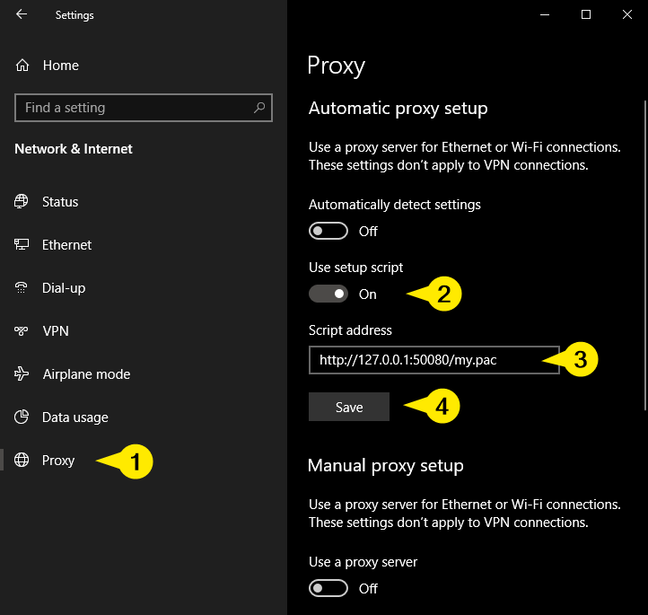
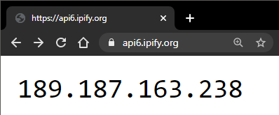

# Proxied OpenVPN

Route traffic through OpenVPN without putting your entire host on the VPN. This container runs an HTTP proxy (Squid) that tunnels through OpenVPN, so you can selectively proxy individual apps or browsers instead of your whole machine.

> **Not intended for production use.**

---

## How it works

Inside the container, [PM2](https://pm2.keymetrics.io/) manages four services:

| Service | Role |
|---------|------|
| OpenVPN | Establishes the VPN tunnel |
| Squid   | HTTP proxy on port 3128, traffic exits via the tunnel |
| Apache  | Static file server on port 80 (optional — useful for PAC files) |
| SSHD    | SSH access into the container |

---

## Quick start

### 1. Prepare your `ovpn/` directory

```
ovpn/
├── connect.sh    ← must be executable (chmod +x)
├── myvpn.ovpn
└── myvpn.pass    ← optional, for password-based profiles
```

**`connect.sh`** — runs OpenVPN. Keep it simple:

```bash
#!/bin/bash
openvpn --config /root/ovpn/myvpn.ovpn 2>&1
```

If your profile uses `auth-user-pass`, the path must be absolute:

```
auth-user-pass /root/ovpn/myvpn.pass
```

### 2. Run the container

```bash
docker run --name openvpn-proxy \
  --detach --restart always \
  --cap-add=NET_ADMIN \
  --dns 8.8.8.8 \
  --publish 53128:3128 \
  --volume "$(pwd)/ovpn:/root/ovpn" \
  openvpn-proxy:latest
```

### 3. Test it

```bash
# Your host's public IP:
curl --silent https://api6.ipify.org

# The proxy's public IP (should be the VPN exit IP):
curl --silent --proxy http://127.0.0.1:53128 https://api6.ipify.org
```

Sample output:

```
Host Public IP:  252.32.109.191
Proxy Public IP: 189.187.163.238
```

You can now use `http://127.0.0.1:53128` as an HTTP proxy in any app.

---

## PAC file hosting (optional)

[Proxy Auto-Configuration (PAC)](https://developer.mozilla.org/en-US/docs/Web/HTTP/Proxy_servers_and_tunneling/Proxy_Auto-Configuration_(PAC)_file) files let browsers and OS-level proxy settings automatically decide what to proxy. Apache serves them (and any other static files) from a bind-mounted directory.

### 1. Create a `static/` directory with a PAC file

**`static/my.pac`:**

```javascript
function FindProxyForURL(url, host) {
  // bypass proxy for local addresses
  if (isInNet(host, "127.0.0.0", "255.0.0.0") ||
      isInNet(host, "10.0.0.0", "255.0.0.0") ||
      isInNet(host, "172.16.0.0", "255.240.0.0") ||
      isInNet(host, "192.168.0.0", "255.255.0.0") ||
      isPlainHostName(host)) {
    return "DIRECT";
  }
  return "PROXY 127.0.0.1:53128";
}
```

### 2. Run with the extra port and volume

```bash
docker run --name openvpn-proxy \
  --detach --restart always \
  --cap-add=NET_ADMIN \
  --dns 8.8.8.8 \
  --publish 50080:80 \
  --publish 53128:3128 \
  --volume "$(pwd)/ovpn:/root/ovpn" \
  --volume "$(pwd)/static:/var/www/html" \
  openvpn-proxy:latest
```

### 3. Verify the PAC file is served

```bash
curl http://127.0.0.1:50080/my.pac
```

Point your system or browser proxy settings at `http://127.0.0.1:50080/my.pac`:



Open `https://api6.ipify.org` in your browser — it should show the VPN exit IP:



---

## License

MIT © 2020 Joseph Baking — see [LICENSE.md](LICENSE.md).
